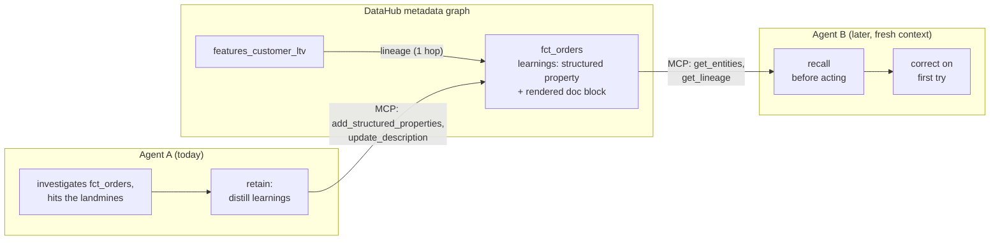

# Lore

**Tribal knowledge for AI agents, stored where your data lives.**

Agents that work with data are goldfish. Every session re-derives the same tribal knowledge (`amount` is in cents, cancelled orders need filtering, the real join key is `customer_key`) and loses it when the context window closes. Schemas describe structure, not semantics, so there is nowhere an agent looks by default that holds these facts.

Lore makes **DataHub the shared long-term memory for agents**. When an agent figures something out, it writes the learning back to the metadata graph. The next agent, and every human browsing the DataHub UI, inherits it.



Measured on a 12-arm eval: **62% fewer queries with memory**, single-query correct answers on metric-definition questions, and one honest failure, reported in full. Details in [`eval/RESULTS.md`](eval/RESULTS.md).

## How it works

Every table already has a profile page in DataHub. Lore adds a memory to it. Think of it as sticky notes on the table itself, written by whoever got burned last:

1. **An agent learns something the hard way.** It computes revenue, gets an absurd number, digs in, and discovers `amount` is stored in cents.
2. **Retain: it writes that fact onto the table's page.** Not a chat log, a small structured note: the claim, the proof, how confident it is, who learned it and when.
3. **Recall: the next agent reads the notes first.** Before touching a table, it checks that table's notes plus the notes of tables one step upstream in the lineage graph. It starts the task already knowing the traps.
4. **Humans get it for free.** The same notes render as a readable "Agent learnings" section on the table's page in the DataHub UI.

One note looks like this:

```yaml
kind: semantic_gotcha           # one of 5 types: gotcha, verified query, join trap, caveat, metric definition
subject_field: amount            # which column it's about
claim: "Values are stored in cents, not dollars; divide by 100 for a dollar amount."
evidence: "SUM(amount) for June = 3,860,433,217 vs. finance dashboard $38,604,332; ratio exactly 100."
confidence: high                 # high = verified against ground truth, not "probably right"
learned_by: analytics-agent/session-7f3a
learned_at: 2026-07-29
```

Three rules keep the memory trustworthy:

- **Only real knowledge gets written.** A six-rule checklist filters candidates: no secrets, nothing the schema already says, no duplicates, evidence must be checkable.
- **Writes can't destroy other writes.** DataHub replaces a property's whole value list on write, so every writer must read the current notes, merge, and write all of them back. The rule exists because we reproduced the data-loss case.
- **Disagreement is preserved, not settled.** If a new observation contradicts an old note, the old one gets flagged `disputed` and a `conflict` note points at it. Both stay visible, because a contradiction often means the data actually changed.

The full rules live in [`protocol/SPEC.md`](protocol/SPEC.md), written so anyone can implement it independently. That claim is tested: [`clients/recall.py`](clients/recall.py) was built from the spec alone and passes live tests. The reference implementation is the [`datahub-learnings` skill](skill/datahub-learnings/).

## What's real / verified

Every claim checked against a live DataHub OSS `v1.5.0.6` quickstart. Full write-up: [`setup/NOTES-mcp-writes.md`](setup/NOTES-mcp-writes.md).

| Claim | Status |
|---|---|
| `string`/`MULTIPLE` structured property on `dataset` and `schemaField` entities | Verified: byte-identical round-trips, no truncation up to 10,000 chars |
| Writes **replace** the whole value list (no append) | Verified, including the data-loss case; read-merge-write is mandatory |
| Doc-block marker splice is idempotent | Verified: splice-twice leaves exactly one block |
| MCP mutation tools work against OSS | Verified on server `>= 0.6.0` with `TOOLS_IS_MUTATION_ENABLED=true`; an unpinned `uvx` can resolve a stale build with no mutation tools |
| schemaField structured-property **writes** via MCP | Verified (the high-level Python SDK cannot; the MCP tool can) |
| schemaField structured-property **reads** via MCP | **Not available** in server 0.6.0: writes succeed, no tool reads them back. Raw-GraphQL workaround documented in the [skill's tool reference](skill/datahub-learnings/references/mcp-tools-reference.md); candidate upstream fix |

## Quickstart (clean machine)

Tested on Windows 11, DataHub OSS `v1.5.0.6`, CLI `1.6.0.16`, `uv` `0.11.32`. Prerequisites: Docker Desktop, [`uv`](https://docs.astral.sh/uv/), Claude Code.

One command runs everything below: `uv run python setup/bootstrap.py`. It is idempotent
(safe to re-run; already-satisfied steps are skipped) and ends by running the doctor for
you. The numbered steps are the manual path, useful as a reference or if a step needs
troubleshooting on its own.

> **Windows gotchas**
> - `datahub docker quickstart` can exit 1 with a `UnicodeEncodeError` on a *successful* run (cp1252 vs its `✔` banner). Trust `docker ps` and the health URLs, not the exit code. `PYTHONIOENCODING=utf-8` avoids it.
> - `uv`/`uvx` may need a shell restart to be on `PATH` after install.

1. **DataHub** (~7 min cold start): `PYTHONIOENCODING=utf-8 datahub docker quickstart`, then check `http://localhost:9002` (UI, `datahub`/`datahub`) and `http://localhost:8080/health`.
2. **Demo warehouse**: `docker compose -f demo/docker-compose.yml up -d` (Postgres on port 5434).
3. **Seed** (deterministic, plants the landmines below): `uv sync && uv run python setup/seed_warehouse.py`
4. **Ingest** (3 tables + a view whose lineage DataHub derives automatically):
   `PYTHONIOENCODING=utf-8 uvx --from "acryl-datahub[postgres]==1.6.0.16" datahub ingest -c setup/ingest_postgres.yml`
5. **Register the property**: `uv run python setup/register_properties.py`
6. **Open the repo in Claude Code**: `.mcp.json` auto-configures the DataHub MCP server; the skill is preinstalled at `.claude/skills/datahub-learnings/`.

Anything misbehaving: `uv run python setup/doctor.py` checks the whole environment with a fix per failure. Deeper troubleshooting: [`demo/README.md`](demo/README.md).

## Install as a plugin

This repo also doubles as a Claude Code plugin marketplace, so any project can get the
skill, hook, and MCP server without cloning the repo:

```
/plugin marketplace add ravadashreyas/Lore
/plugin install lore
```

You get the `datahub-learnings` skill, the `enforce_recall.py` PreToolUse hook, and the
`datahub` MCP server, wired into whichever project you run it from. Details, prerequisites,
and a note on running it inside this repo itself: [`plugins/lore/README.md`](plugins/lore/README.md).

## Run the demo

Full walkthrough in [`demo/README.md`](demo/README.md), including the record of a complete end-to-end rehearsal:

1. `uv run python demo/reset_demo.py` wipes prior learnings.
2. **Agent A** (fresh session): asked for June revenue, gets a suspicious $4.67B, investigates, answers $38.6M correctly, retains 3 learnings.
3. **DataHub UI** (`localhost:9002`): the learnings are on `fct_orders`' page, as properties and rendered documentation.
4. **Agent B** (fresh session): recalls first; its first query already applies the cents fix and status filter.
5. **Agent C** (fresh session, ML engineer): recall walks the lineage edge upstream from `features_customer_ltv` and inherits the analytics agent's knowledge.

[`examples/`](examples/) holds real captured outputs (learnings, doc blocks, and a fully-executed conflict procedure) for judges who run nothing.

## Enforced recall and data permissions (the hooks)

SPEC.md §9 admits recall can't be technically forced. [`hooks/enforce_recall.py`](hooks/enforce_recall.py) closes that gap for Claude Code: a `PreToolUse` hook blocks a Bash command touching a cataloged table once per session, feeds the unsurfaced learnings back as the block reason, and lets the retry through. Fail-open by design.

[`hooks/enforce_permissions.py`](hooks/enforce_permissions.py) adds the complementary control: toggle what an agent may do to the *data* — `read` / `update` / `write`, per table and per column — by editing a `lore-permissions.json` (no file = off; start from [`hooks/permissions.example.json`](hooks/permissions.example.json)). The learnings layer is deliberately exempt: whatever the data grants say, an agent can always recall the sticky notes and retain new ones — being denied access is often exactly the moment it has something worth writing down. Details on both hooks: [`hooks/README.md`](hooks/README.md).

## Governance of the memory itself

- **Garbage control**: the retain checklist governs writes at the source; [`tools/lint_learnings.py`](tools/lint_learnings.py) enforces the checkable rules mechanically across the whole catalog and exits nonzero for CI. Tested both ways: clean pass on real learnings, all four planted violations caught on a scratch dataset. It also caught a real over-length claim written by an agent during rehearsal.
- **Staleness**: no TTL by design (silently deleting knowledge is worse than flagging it). It surfaces via the conflict mechanism and via [`tools/lore_stats.py --stale-days N`](tools/lore_stats.py), a review queue that never deletes anything.
- **Noise at scale**: length caps push toward one sharp fact per record, column scoping keeps facts attached to what they describe, and `lore_stats.py` warns on any entity carrying more than 20 learnings.

## Related approaches

An adjacent design surfaced in this same hackathon ([datahub-skills PR #69](https://github.com/datahub-project/datahub-skills/pull/69)): memory as saved investigation documents, recalled by text search.

| | Document cache (PR #69) | Lore |
|---|---|---|
| Unit of memory | A whole investigation report | One atomic, typed fact |
| Attached to | A document store | The dataset/column it describes |
| Found via | Text search over past reports | Entity lookup + lineage traversal |
| Disagreement | Coexisting reports | Confidence, evidence, disputed/conflict semantics |
| Runs on | Documents feature | Plain OSS structured properties |

The layers are complementary: one caches investigations, the other makes every investigation start with the traps already known. Lore deliberately stores no task answers (retain rule (f)).

## Repo layout

```
protocol/
  SPEC.md                     normative protocol spec: learning schema, recall/retain, conflicts

skill/datahub-learnings/      reference implementation, the candidate upstream PR to datahub-skills
  SKILL.md                    operational workflow: setup, recall, retain, worked examples
  references/                 condensed protocol reference + empirically-verified MCP tool calls
  templates/                  JSON learning-record shape, markdown doc-block shape

.claude-plugin/                repo-root marketplace manifest, so `/plugin marketplace add` finds lore
  marketplace.json

plugins/lore/                  installable Claude Code plugin: bundles the skill, hook, and MCP config
  README.md                    what installing gets you, prerequisites, double-loading note, uninstall

setup/                        one-shot, idempotent setup scripts
  bootstrap.py                one command: runs steps below in order, skips what's already done
  seed_warehouse.py           deterministic demo data + 3 planted landmines + LTV feature view
  register_properties.py      registers io.datahub.agentMemory.learnings on DataHub
  ingest_postgres.yml         ingestion recipe: demo Postgres -> DataHub (incl. view lineage)
  doctor.py                   one-command environment check: run this if anything misbehaves
  NOTES-datahub-quickstart.md raw findings: versions, ports, auth, Windows quirks
  NOTES-mcp-writes.md         raw findings: structured-property + description write-path verification

demo/                         the three-act scenario, runnable end-to-end
  docker-compose.yml          demo Postgres warehouse (port 5434)
  reset_demo.py               wipes learnings between takes
  prompts/                    agent_a.md, agent_b.md, agent_c.md: exact prompts used in the video
  README.md                   full walkthrough + rehearsal record + troubleshooting

clients/                      independent implementation, written from the spec alone
  recall.py                   stdlib-only recall client: proves SPEC.md's interoperability claim

hooks/                        Claude Code enforcement layer: recall + data permissions
  enforce_recall.py           PreToolUse hook: blocks Bash once with unsurfaced learnings, then allows the retry
  enforce_permissions.py      PreToolUse hook: per-table/per-column read/update/write grants on the data;
  permissions.example.json    the learnings layer is always exempt (sticky notes stay readable/writable)

tools/                        governance tooling for the memory itself
  lint_learnings.py           pass/fail linter: validates every learning against SPEC.md's rules, CI-ready
  lore_stats.py               knowledge report: totals, breakdowns, open conflicts, staleness, noise

eval/                         12-arm with/without-memory evaluation
  RESULTS.md                  full per-arm results, including the failure

examples/                     real captured output, no run required to inspect it
```

## The demo scenario is constructed

The warehouse is seeded, not production data: deterministic (seed 42), with three landmines planted on purpose.

| Landmine | Detail | Effect if missed |
|---|---|---|
| `fct_orders.amount` is in cents | `bigint`, unit not indicated | Revenue off by 100x |
| `status` includes cancelled/refunded | 80.8% / 14.4% / 4.8% split | Inflated revenue |
| `customer_id` is legacy, 47% NULL | Real key is `customer_key` | Dropped or wrong joins |

A naive June query returns **4,668,271,415** ("$4.67B"); the correct one returns **$38,604,332.17**. The scenario is staged and we say so. The mechanism is not: every artifact in `examples/` is a genuine readback from a live instance, and every technical claim above was empirically reproduced.

## License

Apache 2.0. See [`LICENSE`](LICENSE).
